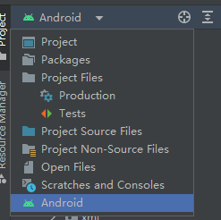
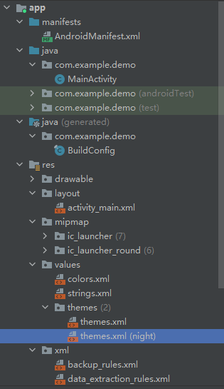

# 第一章Andriod 系统及其开发过程

## Android发展历程

2003年10月，AndyRubin（安迪鲁宾）等人创建Android公司，并组建Android团队。

2005年8月17日，Google低调收购了成立仅22个月的高科技企业Android及其团队。安

  迪鲁宾成为Google公司工程部副总裁，继续负责Android项目。

2007年11月5日，谷歌公司正式向外界展示了这款名为Android的操作系统，并且在这天谷歌宣布建立一个全球性的联盟组织“开放手持设备联盟”（OpenHandsetAlliance）

2008年，在GoogleI/O大会上，谷歌提出了AndroidHAL架构图，在同年8月18号，Android获得了美国联邦通信委员会（FCC）的批准

2008年9月，谷歌正式发布了Android1.0系统，这也是Android系统最早的版本。

## Android系统的系统架构

### 应用程序框架层

应用程序框架可以说是一个应用程序的核心，是所有参与开发的程序员共同使用和遵守的约定。

该框架包含：`活动管理器`、`窗口管理器`、`内容提供者`、`视图系统`、`包管理器`、`电话管理器`、`资源管理器`、`位置管理器`、`通知管理器`、`XMPP服务`

活动管理器:管理各个应用程序的生命周期以及通常的导航回退功能。

窗口管理器：管理所有的窗口程序

内容提供器：使得不同应用程序之间存取或者分享数据。

视图系统:构建应用程序的基本组就是文本框、按钮等。 

通告管理器:使得应用程序可以在状态栏显示自定义的提示信息，通过NotificationManager 、 Notification这两个类可以完成在状态栏显示提示的信息。 

包管理器：安卓系统内的程序管理，Package Manger是一个实际上管理应用程序安装、卸载和升级的API。

电话管理器:管理所有的移动设备 用于管理手机通话状态、获取电话信息（设备、sim卡、网络信息），监听电话状态以及调用电话拨号器拨打电话。

资源管理器:提供应用程序使用的各种非代码资源。

位置管理器:提供位置服务

### 运行库层

通过一些c/c++库来为Android提供主要的特性支持，如SQLite提供了数据库的支持，OpenGL|ES库提供了3D绘图的支持，WebKit库提供了浏览器内核的支持等等。同时在这一层的还有Android运行时库提供了一些核心库，能够允许开发者使用JAVA语言来编写Android应用。还包含了虚拟机Dalvik但之后改为了ART运行环境，使每一个Android应用都有自己的进程，并且都有一个自己的Dalvik虚拟机实例，相较于JAVA的虚拟机，Dalvik是专门为移动设备定制的，针对内存和CPU性能都有了优化。

Android的系统运行库包含两部分，一个是系统库，另一个是运行时。

### Linux内核层

Android系统是基于Linux内核的，这一层为Android设备的各种硬件提供了底层的驱动（如显示，音频，照相机，蓝牙，WI-FI，电源管理等等）

关于内核的作用简单说就是提供了进程管理、文件网络管理、系统安全权限管理、以及系统与硬件设备通讯基础。而在无论Android还是iOS这类高度依赖框架的多层次操作系统上，内核对上层开发者来说是几乎不可见的，只能通过开放给你的框架接口进行相关操作。

## Android开发分类

原生APP开发

混合开发（Hybrid APP）

特点：与Html5混合，Html5和Android之间产生交互，当前的主流方式

## Android项目结构

在Android Studio中设置项目结构显示为Android



可以看到项目结构如下：



其主要目录如下：

- app
  - manifests(d)
    - AndroidManifest.xml - 项目的配置信息文件,应用程序名称，权限声明，组件声明等
  - java(d) - java源码,包括应用程序的Activity，Service和BroadcastReceiver等组件。
  - res(d)
    - anim(d) - xml 格式的动画资源
    - drawable(d) - 存放图形资源的目录
    - layout(d) - 布局文件目录
      - activity_main.xml
    - mipmap(d) - 存放应用程序图标资源的目录
      - drawable-xhdpi - 96 × 96
      - drawable-hdpi - 72 × 72
      - drawable-mdpi - 48 × 48
      - drawable-ldpi - 36 × 36
    - values(d) - 存放应用程序资源值的目录，用于存放各种字符串、颜色、尺寸等与应用程序UI相关的值
      - colors.xml
      - strings.xml
      - themes(d) - 自定义主题
    - xml(d) - 存放各种XML文件的目录，如布局文件、菜单文件、动画文件、样式文件
  - assets(d) - 可以存放任意资源，不会被编译

# 第二章 用户界面设计

## 组件包widget 和 View类

### 常见组件

| **可视化组件**   | **说明**                                               |
| ---------------- | ------------------------------------------------------ |
| **Button**       | **按钮**                                               |
| **CalendarView** | **日历视图**                                           |
| **CheckBox**     | **复选框**                                             |
| **EditText**     | **可编辑的文本输入框**                                 |
| **ImageView**    | **显示图像或图标，并提供缩放、着色等各种图像处理方法** |
| **ListView**     | **列表框视图**                                         |
| **MapView**      | **地图视图****                                         |
| **RadioGroup**   | **单选按钮组件**                                       |
| **Spinner**      | **下拉列表**                                           |
| **TextView**     | **文本标签**                                           |
| **WebView**      | **网页浏览器视图**                                     |
| **Toast**        | **消息提示**                                           |

View是用户界面组件的共同父类，几乎所有的用户界面组件都是继承View类而实现的，如TextView、Button、EditText等。 

对View类及其子类的属性进行设置，可以在布局文件XML中设置，也可以通过成员方法在Java代码文件中动态设置。

### 常见方法和属性

#### View类

属性

| 属 性              | 对 应 方 法                       | 说  明                                               |
| ---------------------- | ------------------------------------- | -------------------------------------------------------- |
| android:background | setBackgroundColor(int color) | 设置背景颜色                                         |
| android:id         | setId(int)                    | 为组件设置可通过findViewById方法获取的标识符 |
| android:alpha      | setAlpha(float)               | 设置透明度，取值[0，1]之间           |
|                        | findViewById(int id)          | 与id所对应的组件建立关联                     |
| android:visibility | setVisibility(int)            | 设置组件的可见性                                     |
| android:clickable  | setClickable(boolean) | 设置组件是否响应单击事件                             |

#### TextView

方法

| **方   法**                     | **功   能**                |
| ------------------------------- | -------------------------- |
| **getText**();                  | **获取文本标签的文本内容** |
| **setText(CharSequence text);** | **设置文本标签的文本内容** |
| **setTextSize(float);**         | **设置文本标签的文本大小** |
| **setTextColor(int color);**    | **设置文本标签的文本颜色** |

属性

| **元 素 属 性**           | **说   明**                                                  |
| ------------------------- | ------------------------------------------------------------ |
| **android:id**            | **文本标签标识**                                             |
| **android:layout_width**  | **文本标签**TextView的宽度，通常取值"fill_parent"（屏幕宽度）或以像素为单位pt的固定值 |
| **android:layout_height** | **文本标签**TextView的高度，通常取值" **wrap_content** "（文本的高）或以像素p为单位的固定值 |
| **android:text**          | **文本标签**TextView的文本内容                               |
| **android:textSize**      | **文本标签**TextView的文本大小                               |

#### Button

| 方法                 | 说明           |
| -------------------- | -------------- |
| setOnClickListener() | 设置点击监听器 |
| setClickable()       | 设置是否可点击 |
| setEnabled()         | 设置是否可用   |

setOnClickListener()示例

```java
Button button;
button.setOnClickListener((v)->{
	// v就是button对象自己
});
```

#### EditText

方法

| **方法**                       | **功能**                         |
| ------------------------------ | -------------------------------- |
| **EditText**(Context context)  | **构造方法，创建文本编辑框对象** |
| **getText**()                  | **获取文本编辑框的文本内容**     |
| **setText(CharSequence text)** | **设置文本编辑框的文本内容**     |

属性

| **元素属性**            | **说明**                                            |
| ----------------------- | --------------------------------------------------- |
| **android:editable**    | 设置是否可编辑，其值为“true”或“false”               |
| **android:numeric**     | **设置**TextView只能输入数字，其参数默认值为假**    |
| **android:password**    | 设置密码输入，字符显示为圆点，其值为“true”或“false” |
| **android:phoneNumber** | **设置只能输入电话号码，其值为“**true”或“false”     |

## 布局管理

布局有`LinearLayout`-线性布局、`FrameLayout`-框架布局、`TableLayout`-表格布局、`RelativeLayout`-相对布局、`GridLayout`-网格布局。 

